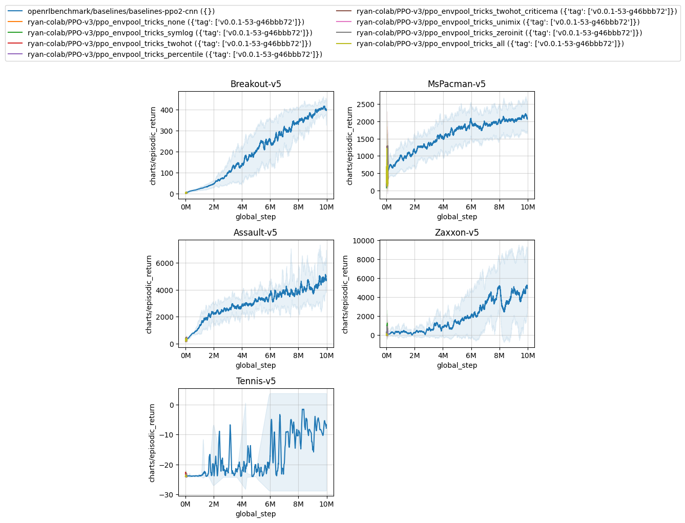
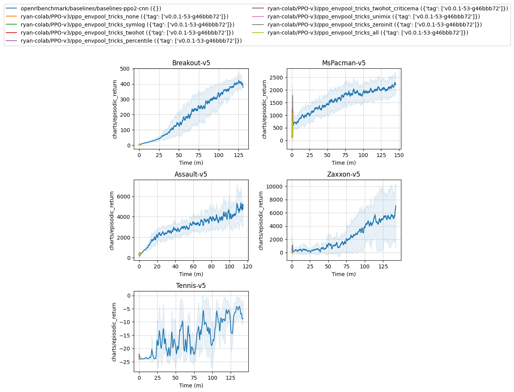

# PPO-v3
Adding Dreamer-v3's implementation tricks to CleanRL's PPO

## Get started

```bash
poetry install
poetry run pip install --pre torch --index-url https://download.pytorch.org/whl/nightly/cu117
```


## Running experiments

For quick and easy experiments, feel free to just run them with the `--track` flag and use wandb's report to visualize them. For slightly more serious experiments, please use the benchmark utility.

The following commands will generate the dry run commands.
```bash
python -m cleanrl_utils.benchmark \
    --env-ids Breakout-v5 Pong-v5 \
    --command "poetry run python ppo_v3/ppo_atari_envpool.py --track" \
    --num-seeds 3
```
```
autotag feature is enabled
identified git tag: v0.0.1-4-gb17d3b5
local variable 'pr_number' referenced before assignment
======= commands to run:
poetry run python ppo_v3/ppo_atari_envpool.py --track --env-id Breakout-v5 --seed 1
poetry run python ppo_v3/ppo_atari_envpool.py --track --env-id Pong-v5 --seed 1
poetry run python ppo_v3/ppo_atari_envpool.py --track --env-id Breakout-v5 --seed 2
poetry run python ppo_v3/ppo_atari_envpool.py --track --env-id Pong-v5 --seed 2
poetry run python ppo_v3/ppo_atari_envpool.py --track --env-id Breakout-v5 --seed 3
poetry run python ppo_v3/ppo_atari_envpool.py --track --env-id Pong-v5 --seed 3
not running the experiments because --workers is set to 0; just printing the commands to run
```

Once you are comfortable with the commands, you can run them with `--workers 1` to run them in a single machine

```
python -m cleanrl_utils.benchmark \
    --env-ids Breakout-v5 Pong-v5 \
    --command "poetry run python ppo_v3/ppo_atari_envpool.py --track" \
    --num-seeds 3
    --workers 1
```

>**Warning** While it is possible to run it with `--workers 6`, it is not recommended. Envpool will likely compete for resources with the other workers and will slow down the experiments.

It is also possible to use slurm. For example, the following command will generate a slurm script and submit it to the slurm queue.

```
python -m cleanrl_utils.benchmark \
    --env-ids Breakout-v5 Pong-v5 \
    --command "poetry run python ppo_v3/ppo_atari_envpool.py --track" \
    --num-seeds 3
    --workers 1
    --slurm-gpus-per-task 1 \
    --slurm-template-path ppov3.slurm_template
```
```
autotag feature is enabled
identified git tag: v0.0.1-4-gb17d3b5
local variable 'pr_number' referenced before assignment
======= commands to run:
poetry run python ppo_v3/ppo_atari_envpool.py --track --env-id Breakout-v5 --seed 1
poetry run python ppo_v3/ppo_atari_envpool.py --track --env-id Pong-v5 --seed 1
poetry run python ppo_v3/ppo_atari_envpool.py --track --env-id Breakout-v5 --seed 2
poetry run python ppo_v3/ppo_atari_envpool.py --track --env-id Pong-v5 --seed 2
poetry run python ppo_v3/ppo_atari_envpool.py --track --env-id Breakout-v5 --seed 3
poetry run python ppo_v3/ppo_atari_envpool.py --track --env-id Pong-v5 --seed 3
not running the experiments because --workers is set to 0; just printing the commands to run
======= slurm commands to run:
saving command in slurm/5edda234-e8b9-4014-a164-9964e2475847.slurm
running sbatch slurm/5edda234-e8b9-4014-a164-9964e2475847.slurm
sbatch: [info] Determined priority for your job: idle
Submitted batch job 19846
```

The logs will be available in the `slurm/logs` folder.


## Compare experiments & autotag

When running the experiments with `python -m cleanrl_utils.benchmark`, the script will automatically tag the git commit. This is useful for comparing experiments and for reproducibility. For example, when running 

```
python -m cleanrl_utils.benchmark \
    --env-ids Breakout-v5 \
    --command "poetry run python ppo_v3/ppo_atari_envpool.py --track" \
    --num-seeds 1 \
    --workers 1
```

The experiments will be tagged with `v0.0.1-5-g61d4028`.


> **Note** Wandb tags are super useful! You can also prepend the `python -m cleanrl_utils.benchmark` command with custom tags such as `WANDB_TAGS=rtx3060`. 


We can then use this tag for comparing experiments leveraging the `openrlbenchmark` utility.

```
python -m openrlbenchmark.rlops \
    --filters '?we=openrlbenchmark&wpn=baselines&ceik=env&cen=exp_name&metric=charts/episodic_return' 'baselines-ppo2-cnn' \
    --filters '?we=dream-team-v3&wpn=PPO-v3&ceik=env_id&cen=exp_name&metric=charts/episodic_return' 'ppo_atari_envpool?tag=v0.0.1-5-g61d4028' \
    --env-ids Breakout-v5 \
    --check-empty-runs False \
    --ncols 1 \
    --ncols-legend 1 \
    --output-filename static/cleanrl_vs_baselines \
    --scan-history \
    --report
```
It's going to generate the following plots:

| cleanrl_vs_baselines.png             |  cleanrl_vs_baselines-time.png |
:-------------------------:|:-------------------------:
  |  


Furthermore, it will generate a table with the following information:

|             | openrlbenchmark/baselines/baselines-ppo2-cnn ({})   | dream-team-v3/PPO-v3/ppo_atari_envpool ({'tag': ['v0.0.1-5-g61d4028']})   |
|:------------|:----------------------------------------------------|:--------------------------------------------------------------------------|
| Breakout-v5 | 405.73 ± 11.47                                      | 403.59 ± 0.00                                                             |

## Hyperparameter tuning

The `cleanrl_utils` package also provides a hyperparameter tuning utility. It is based on [Optuna](https://optuna.org/). See [docs](https://docs.cleanrl.dev/advanced/hyperparameter-tuning/) for more detail. I have also included an example `tune_ppo_atari_envpool.py` in the root folder.


## `poetry` tips

Poetry locks the dependencies and makes sure that we are using the same versions of the dependencies. It also helps us manage our virtual environments. It is a great tool to use for any python project. For a good usage tutorial, check out [CleanRL's usage guide](https://docs.cleanrl.dev/get-started/basic-usage/)

Additionally, when adding dependencies, it's best to use the `poetry add mypackage` command. When updating dependencies, it's best to use the `poetry update mypackage` command. As a last resort, you can modify `pyproject.toml` directly, and then run `poetry lock --no-update`.

>**Warning** Do not attempt to run `poetry lock`. It will update all dependencies and will likely take a long time to complete.

